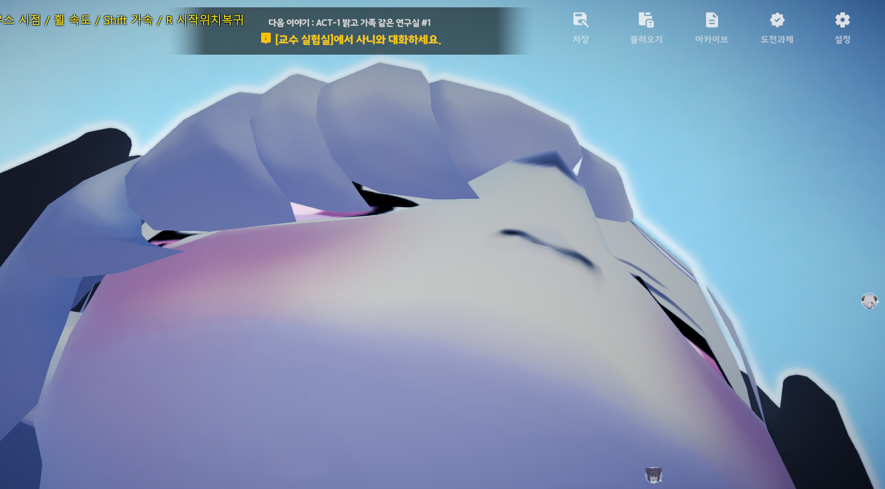

# Saniyang FreeCam

사니양 연구실용 비공식 BepInEx 플러그인. 프리캠(자유비행 카메라) + 안개 제거 + 캐릭터 하이라이트/UI 숨기기.

**게임사 공식 도구 아님.** 재미로 가볍게 만든 거라 자잘한 버그가 있을 수 있습니다.



장점: 사니의 오른쪽 눈을 볼 수 있음

## 기능

| 키 | 기능 |
|---|---|
| F7 / `\` | 프리캠 켜기/끄기 |
| F8 / `[` | 안개 끄기/켜기 (RenderSettings + URP Volume Fog override까지 확실히 제거) |
| F9 / `]` | 캐릭터 마우스오버 하이라이트 끄기/켜기 |
| F10 / Delete | UI 숨기기/보이기 (프리캠 HUD는 유지) |
| F5 / Backspace | 시간정지 (NPC/애니메이션/트윈 전부 멈춤, `Time.timeScale=0`) — 프리캠은 계속 움직임 |
| WASD | 이동, Space/Ctrl(또는 C) 상하 |
| 마우스 | 시점 (우클릭 없이 바로 조작, 켜지면 커서 잠금) |
| 휠 | 이동 속도 조절 |
| Shift | 가속 |
| R / Home | 프리캠 켰던 시작 위치로 복귀 |
| F6 / H | 좌상단 안내 HUD 숨기기/보이기 |

F11 이상은 브라우저·OS 전체화면 단축키랑 겹치는 경우가 있어서 F5~F10 범위로 묶었고, 전부 대괄호/Delete/Backspace/H 같은 보조키가 하나씩 더 있습니다.

카메라 pose는 URP `beginCameraRendering` 콜백에서 매 프레임 강제로 덮어써서 게임 자체 카메라 경계(boundary)를 무시합니다. 끌 때는 시작 위치로 스냅한 뒤 게임 카메라 컴포넌트를 복원해서, 맵 밖에 있다가 꺼도 안전하게 이어받습니다.

## 설치

1. 게임에 [BepInEx](https://github.com/BepInEx/BepInEx) 5.x가 이미 설치되어 있어야 합니다.
2. [Releases](../../releases)에서 `SaniyangFreeCamMod.dll` 다운로드
3. 게임 설치 폴더의 `BepInEx\plugins\` 안에 넣기
4. 게임 실행 후 F8

## 직접 빌드하기

`Plugin/SaniyangFreeCamMod.csproj`의 `HintPath`들이 특정 로컬 경로(게임 Managed 폴더, BepInEx core 폴더)를 가리키고 있습니다. 본인 환경에 맞게 아래로 바꿔서 빌드하세요:

- `UnityEngine*.dll`, `Assembly-CSharp.dll` → 게임 설치 폴더의 `sanyPlus_Data\Managed\`
- `BepInEx.dll`, `0Harmony.dll` → 본인이 설치한 BepInEx의 `BepInEx\core\`

```bash
cd Plugin
dotnet build -c Release
```

결과물: `Plugin/bin/Release/net46/SaniyangFreeCamMod.dll`

## 라이선스

[MIT](LICENSE)
